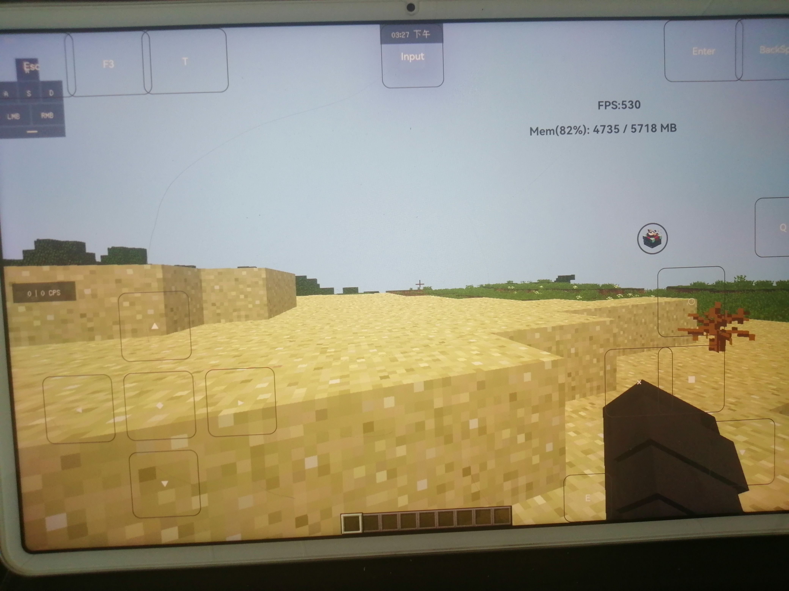

<div style="text-align: center;"><h1>GreenManServer OpenSource</h1></div>

<p align="center">
  
     
  
  
</p>

## 细节

GreenManServer 是由来自**南昌新建五中**邓浩林女士和**他的ai**于公元2026年公开我的世界服务器mod，目标版本为 Minecraft 1.21.11 + Fabric。

## 假如给我三天圈币

注意，本客户端**肯定**是因为邓浩林女士不会编写任何Java字节码，没有任何Java基础，纯由ai进行编写，在病症观察过程中所做出来的言行举止可能患有[智力发育障碍](https://zh.wikipedia.org/wiki/智能障礙)，且进群获取方式高达2个哔哩哔哩硬币，远远高于其得到的价值，所以我们决定将其开源。

## 光辉事迹

## 神权1
在公元2026年7月12日邓浩林女士在自己的傻逼交流群里发现了两个不该出现的人，但患有
[智力发育障碍](https://zh.wikipedia.org/wiki/智能障礙)的邓浩林女士并未察觉到这两个人并没有在群里惹过事。

在我们一番询问后竟是我们合伙起来骂他？？但不可否认的是，我们并没有骂过这位在南昌新建上初中的邓浩林女士，我们骂的是他使用**华为ᵀᴹMatePad 11**制作了一个10000个mod来优化性能的优化包

<p align="center">
  
  
<p>

然后邓浩林女士决定使用他已经**脑淤血**的大脑想了一万年想出了复读的解决方式，但群公告写了**本群禁止复读**(见52行)，但[智力发育障碍](https://zh.wikipedia.org/wiki/智能障礙)的邓浩林女士并不知情，仍坚持复读

<p align="center">
  
<p>

但邓浩林女士好像想起来了他栓了他最爱的一只**小狗**，于是护主的**小狗**把这两个攻击他**主人**的人瞎骂了一下

<p align="center">
  
  
<p>

邓浩林女士在[智力发育障碍](https://zh.wikipedia.org/wiki/智能障礙)的情况下思考了一会，决定将这两个人移出群聊

<p align="center">
  
<p>

## 神权2

患有[智力发育障碍](https://zh.wikipedia.org/wiki/智能障礙)的邓浩林女士在群公告里写了**本群禁止复读，无效冒泡，例如每天重复发送冒泡表情包或空格，数字，字母等**其中的**无效冒泡**被邓浩林女士理解为了**冒泡**由于她患有[智力发育障碍](https://zh.wikipedia.org/wiki/智能障礙)，在看到一条冒泡消息后，把其发送人踢了三个群聊，并且拒绝其后续加群

<p align="center">
  
<p>

## 理直气壮用ai

邓浩林女士在使用他的**华为ᵀᴹMatePad 11**发布完视频之后，一人在他的评论区说他使用了AI工具，但我们[智力发育障碍](https://zh.wikipedia.org/wiki/智能障礙)的邓浩林女士却理直气壮的说**没人逼着你用AI**
我们在还原这个项目时，邓浩林女士认为每个人还原代码都要使用ai，可他的狗屎mod并没有任何混淆，在我们半个小时的时间就把他的狗屎mod还原出来了

<p align="center">
  
  
<p>

## 不肯承认现实

公元2026年4月26日，邓浩林女士在一条**提升mc**帧数的视频下方发布了评论"直接来用我的优化包就行了"，但有些聪明人发现了他的优化包纯是加一堆的优化模组来达到优化的效果，邓浩林并不承认现实，只能说"有本事你来做"

<p align="center">
  
<p>

## 朝花夕拾
## 邓浩林在之前还不是狗屎包制作者，还是一个普通的华为平板使用者，在他南昌的家中询问平板玩java版，网易如何迁移存档

<p align="center">
  
  
<p>

## 华为平板全貌

<p align="center">
  
<p>

## 环境要求

- **JDK 21**
- Gradle Wrapper 9.5.1（`./gradlew` 自动下载）
- **一份装了 Fabric 的本地 Minecraft 1.21.11 目录**。和 `libraries/`
- highiq

## 构建和运行

```
./gradlew build
```

产物：**`build/libs/greenmanserver-1.1.0.jar`**


```
./gradlew runServer
```

可以把产物直接丢进任意 1.21.11 Fabric 服务器器的 `mods/`。

**如果你是残疾人，可以让ai帮你。**

## IntelliJ IDEA

1. 打开工程目录，等 gradle 同步完成
2. 项目 SDK 选 JDK 21
3. `.run/` 下已有三份运行配置（Build / GreenMan Server / Remap Minecraft）。

## 致谢

- **原始mod：** GreenManServer 1.1.0
- **反混淆、符号恢复、还原：** 由人工完成
- **Java Deobfuscator**
- **Recaf**
- **从古墓中挖出的**华为ᵀᴹMatePad 11